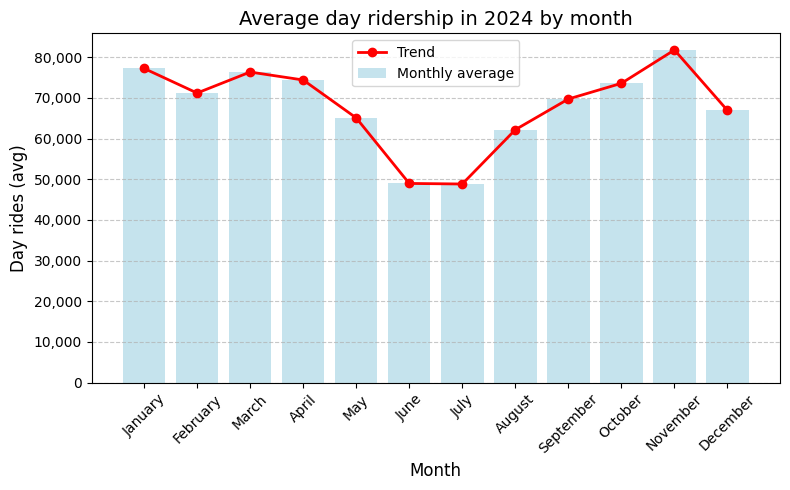
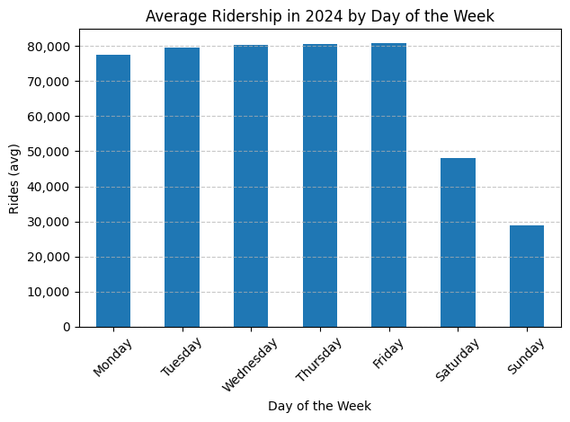
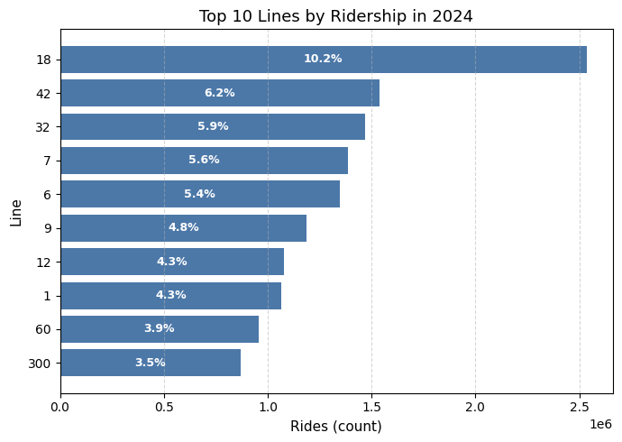
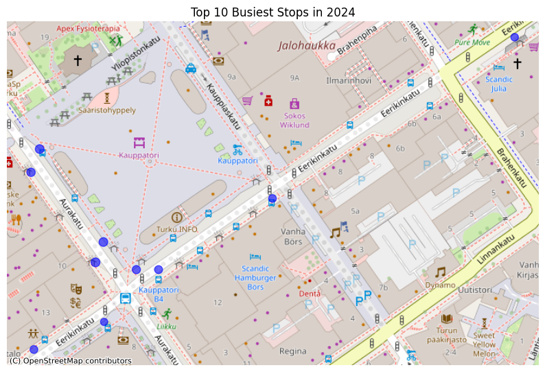

# Turku Bus Ridership 2024 Analysis

This project explores public transport ridership in Turku, Finland, during 2024. Using open data from *Föli* (Turku Region Public Transport), it analyzes how passenger numbers change over time and across the network — by day, month, line, and stop.


## Project Overview
The goal of this project is to understand temporal ridership patterns (daily, monthly, seasonal), identify the most used bus lines and stops, visualize spatial distribution of ridership across Turku, and evaluate how weekends, holidays, and school breaks affect demand. 


## Key Insights and visualizations

Strong seasonal variation: lowest in June–July, during school holidays, highest in November, pre-Christmas time. 

<p align="center">
  
</p>


Weekday ridership rises slightly through the week, peaking on Friday. Weekend travel is much lighter: Saturday averages about 40 % fewer rides than Friday, and Sunday roughly 40 % fewer than Saturday.

<p align="center">
  
</p>

Line 18 carries more than 10% of total ridership   and top ten lines together handle over 50% of all the rides.  

<p align="center">
  
</p>


Nine of ten busiest stops are located in Kauppatori (Market Square), the remaining one is also close by.

<p align="center">
  
</p>


## Data Source
Dataset: “Turun seudun joukkoliikenteen käyttäjämääriä”  

Source: https://www.avoindata.fi/data/en_GB/dataset/turun-seudun-joukkoliikenteen-kayttajamaaria

Provider: City of Turku – Föli Open Data Portal  

License: Creative Commons Attribution 4.0 International (CC BY 4.0) — https://creativecommons.org/licenses/by/4.0/  

Attribution: “Turun seudun joukkoliikenteen käyttäjämääriä” by City of Turku, licensed under CC BY 4.0.


## Technologies Used
Python 3.11  
Pandas, NumPy  
Matplotlib, Seaborn  
GeoPandas, Folium, Contextily  
Jupyter Notebook

## Project structure

```Python
turku-bus-project/
├── data/ # Source data (Föli ridership CSVs, stops.json)
├── figures/ # Saved static charts for README 
├── html_outputs/ # Interactive maps
├── notebooks/
│ └── exploration.ipynb # Main analysis notebook
├── scripts/
│ └── load_and_merge.py # Helper function for loading and cleaning data
├── requirements.txt # Python package dependencies
├── .gitignore # Files and folders excluded from version control
├── LICENSE # Project license 
└── README.md # This file
```

## Author
Created by Alexander Zakharov in 2025.  
Feedback and suggestions are welcome.


